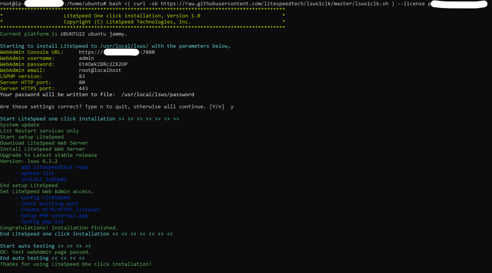

[](https://pagespeed.web.dev/analysis/https-demo-assettolab-com/dwpohsegcl?form_factor=desktop)
[](#622-loaderio-bench)
[](#63-cache-optimization)
[](#)
[](#)


# [CASE STUDY] WordPress on AWS Free Tier: 50K Pageviews/Week with LiteSpeed + Redis Optimization
⚠️ **Notice:** Some details such as server IPs, domain names, and keys have been masked or anonymized, as this is a live production system.


## 1. 📌 Objectives

- Handle 52K+ weekly pageviews using AWS Free Tier (t2.micro)
- Optimize performance with LiteSpeed Enterprise + Redis
- Maintain uptime >99.9% with $0 infrastructure cost (excluding CDN)

## 2. ⚙️ Infrastructure Overview

- **VPS:** AWS EC2 Free Tier (`t2.micro` – 1 vCPU, 1 GB RAM, 30 GB gp3 SSD)
- **OS:** Ubuntu 22.04 LTS
- **Web Server:** LiteSpeed Enterprise - LSWS (Starter License – $0)
- **Database:** MariaDB 10.5 (lightweight & optimal for low-memory VPS)
- **Cache:** Redis (Object Cache) + LiteSpeed Cache (LSCWP plugin)
- **CDN & DNS:** Cloudflare (Free plan) + .COM domain (via DreamHost)


```text
Request → Cloudflare CDN → LiteSpeed Enterprise → WordPress → Redis / MySQL
                        ↓
                Cached Response (LiteSpeed + Cloudflare)
```

## 3. 🛠 Deployment & Configuration

### 3.1 VPS & SSH Setup

```bash
# Access new EC2 instance using Windows Terminal and created keypair
ssh -i "aclab-v2-aws-keypair.pem" ubuntu@ec2-example.compute.amazonaws.com

# Update system as regular user
sudo apt update && sudo apt upgrade -y
sudo apt install htop curl wget unzip -y

# Elevate to full root shell
sudo -s -H

# Set timezone & hostname
timedatectl set-timezone UTC
hostnamectl set-hostname aclab-frankfurt-02

# Disable unused services
systemctl disable --now snapd lxd.service multipathd.service

# SSH hardening
nano /etc/ssh/sshd_config
# -> PermitRootLogin no
# -> PasswordAuthentication no
systemctl reload ssh
```
### 3.2 Create Swap (Required for 1GB RAM)

Set up swap memory to ensure system stability under low RAM (t2.micro = 1GB). This helps PHP, MySQL, and Redis run more reliably.


```bash
# Create 2GB swap file
fallocate -l 2G /swapfile

# Secure permissions
chmod 600 /swapfile

# Format swap
mkswap /swapfile

# Enable swap
swapon /swapfile

# Auto-enable swap on reboot
echo '/swapfile none swap sw 0 0' >> /etc/fstab

# Optimize swappiness
echo 'vm.swappiness=10' >> /etc/sysctl.conf
sysctl -p
```

### 3.3 Security Setup

Configure internal firewall (UFW) to only allow essential ports for public traffic.
This complements AWS Security Groups and adds protection from misconfigured internal services.

```bash
# Enable essential services
ufw allow OpenSSH
ufw allow http
ufw allow https

# Deny internal ports
ufw deny in from any to any port 3306
ufw deny in from any to any port 6379

# Enable UFW
ufw enable
ufw status verbose  # (optional) view rules
```


### 3.4 Install LiteSpeed + PHP (LSAPI)

> 💡 Note: Manual LSWS + LSPHP setup often leads to PHP not executing (e.g., `.php` files downloading instead).  
> This setup uses the official install script to avoid those issues, save lots of time.


```bash
# Install LiteSpeed Enterprise + LSPHP (Starter License is free)
bash <( curl -sk https://raw.githubusercontent.com/litespeedtech/lsws1clk/master/lsws1clk.sh ) --license [LICENSE_NO]
```
Setup will completed in 3-4 minutes, the output should be like this:
```bash
Set LiteSpeed Web Admin access.
     - Config LiteSpeed
     - Check existing port
     - Create HTTP/HTTPS listener
     - Setup PHP external App
     - Config php.ini
Congratulations! Installation finished.
End LiteSpeed one click installation << << << << << << <<

Start auto testing >> >> >> >>
OK: test webAdmin page passed.
End auto testing << << << <<
Thanks for using LiteSpeed One click installation!
```
By default, the WebAdmin GUI listens on port `7080`.  
To reduce exposure to port scans, i'll change it to a custom port like `1666`.

Edit the config file:

```bash
nano /usr/local/lsws/admin/conf/admin_config.xml
```
Find this `<listener>` block:

```xml
<listener>
    <name>adminListener</name>
    <address>*:7080</address>
    <secure>0</secure>
</listener>
```

→ Change to:

```xml
<listener>
    <name>adminListener</name>
    <address>*:1666</address>
    <secure>0</secure>
</listener>
```
Then:

```bash
# Allow the new admin port
ufw allow 1666

# Also add this port to AWS Security Group (inbound)

# Change WebAdmin GUI password (optional but highly recommended)
usr/local/lsws/admin/misc/admpass.sh

# Restart LiteSpeed to apply changes
service lsws restart
```
Last but not least, we need to create a Virtual Host for each website running on LiteSpeed.  
This was done via the WebAdmin GUI, so I'm not diving into step-by-step details here.

> 📂 Document root: `/usr/local/lsws/assettolab.com/public_html`

> ⚠️ LiteSpeed Enterprise's WebAdmin interface and documentation for Virtual Host creation are outdated and fragmented.  
> For this deployment, I adapted the configuration structure from OpenLiteSpeed, which shares the same `vhconf.conf` format.  
> This let me bypass GUI limitations and apply a clean vHost setup manually.


### 3.5 MariaDB Installation

Install a reliable and lightweight MySQL-compatible database system to serve WordPress.

```bash
# Add MariaDB 10.5 APT repo
apt install software-properties-common -y
apt-key adv --fetch-keys 'https://mariadb.org/mariadb_release_signing_key.asc'
add-apt-repository 'deb [arch=amd64] http://mirror.23media.com/mariadb/repo/10.5/ubuntu jammy main'

# Install MariaDB 10.5
apt update
apt install mariadb-server mariadb-client -y
```
Check service status, it should be active (running).

```bash
systemctl status mariadb
```

### 3.6 Secure and Prepare Database

```bash
# Secure MariaDB (optional in dev environment)
sudo mysql_secure_installation
```
Example choices:
```bash
Enter current password for root (enter for none): enter
Switch to unix_socket authentication?             [Y/n]  n
Change the root password?                         [Y/n]  y
New password:                                     ********
Remove anonymous users?                           [Y/n]  y
Disallow root login remotely?                     [Y/n]  y
Remove test database and access to it?            [Y/n]  y
Reload privilege tables now?                      [Y/n]  y    
```
We will create a dedicated WordPress database and user, then import an existing SQL dump from localhost.

```bash
# Access MariaDB as root
sudo mysql -u root -p
```
Inside the MariaDB prompt:
```sql
CREATE DATABASE aclabv2_db DEFAULT CHARACTER SET utf8mb4 COLLATE utf8mb4_unicode_ci;
CREATE USER 'aclabv2_user'@'localhost' IDENTIFIED BY 'password@12345';
GRANT ALL PRIVILEGES ON aclabv2_db.* TO 'aclabv2_user'@'localhost';
FLUSH PRIVILEGES;
EXIT;
```

  💡 Replace aclabv2_db, aclabv2_user, and password with your actual site credentials used in wp-config.php.

Now i will import the SQL dump using a privileged user (usually root):

```bash
mysql -u root -p wpdb < /path/to/wordpress.sql
``` 
  💡 Even though wpuser was granted access, root is recommended for importing full .sql dumps — especially if the file includes CREATE TABLE, DROP, or INSERT statements.


## 4. ✊ WordPress Setup

The full WordPress site (previously built and fully tested on localhost) was zipped and initially uploaded to the server via `scp`:

```bash
scp aclabv2.zip ubuntu@<EC2_PUBLIC_DNS>:/usr/local/lsws/assettolab.com/public_html/
```

🛠 Due to extremely slow transfer speed (~200KB/s) using `scp` and large file size (~120MB), I switched to uploading the archive to Mediafire and downloading it from the VPS with wget instead:

```bash
wget https://www.mediafire.com/path/to/aclabv2.zip
```
This method was significantly faster and more stable.

After upload:

```bash
mv aclabv2.zip /usr/local/lsws/assettolab.com/public_html/
cd /usr/local/lsws/assettolab.com/public_html/
unzip aclabv2.zip
chown -R nobody:nogroup
```

📁 Source was placed directly under the Virtual Host's docRoot.
It already contains a working wp-config.php matching the imported database from Section 3.8.

### 4.2 Configure wp-config.php
Database config was updated to match the MariaDB credentials:

```php
/** Database settings */
define( 'DB_NAME',     'aclabv2_db' );
define( 'DB_USER',     'aclavv2_user' );
define( 'DB_PASSWORD', 'password@12345' );
define( 'DB_HOST',     'localhost' );
define( 'DB_CHARSET',  'utf8mb4' );
define( 'DB_COLLATE',  '' );
```

Other optional constants (debug, memory limit, etc.) were added later during optimization phase.

### 4.3 Test Site Access
Once source code and database were in place, visiting the site showed expected behavior.

  ✅ PHP handler was verified earlier via phpinfo()

  ✅ 404 errors resolved after proper vHost + restart

  ✅ No redirect loop or MIME download issue

### 4.4 Cleanup
Removed testing files like info.php, and verified file/folder permissions.

```bash
rm info.php
chown -R nobody:nogroup public_html
```

## 5. 🚀 Performance Optimization

### 5.1 🔐 HTTPS, HTTP/3 & CDN Transport

To optimize TTFB, support Cloudflare caching, and enable HTTP/3, SSL was configured using Let's Encrypt:

```bash
# Stop LSWS
service lsws stop

# Issue cert (standalone)
certbot certonly --standalone -d demo.assettolab.com -d www.demo.assettolab.com

# Restart LSWS
service lsws start
```

SSL certs were applied via LSWS WebAdmin:

`/etc/letsencrypt/live/demo.assettolab.com/fullchain.pem`

`/etc/letsencrypt/live/demo.assettolab.com/privkey.pem`

✅ Result:

- HTTPS fully enforced (no mixed content)

- HTTP/3 and Early Hints supported

- Cloudflare “Full (Strict)” SSL mode enabled

### 5.2 ⚡ Cloudflare Caching Rules

**Configured Cloudflare (Free Plan):**

- Cache Everything (static assets): TTL = 1 year

- Root path (/): standard HTML caching (Edge TTL: 4h)

- Bypass: /wp-admin/, logged-in cookies

- Compression: Brotli enabled

5.3 🔄 Redis Object Cache (Local)

Redis was installed locally to reduce MySQL query load and accelerate dynamic content delivery.

```bash
apt install redis-server -y
```

Configured /etc/redis/redis.conf:

```ini
maxmemory 256mb
maxmemory-policy allkeys-lru
timeout 300
```

Updated wp-config.php:

```php
define('WP_REDIS_HOST', '127.0.0.1');
define('WP_REDIS_PORT', 6379);
define('WP_CACHE', true);
```

Redis PHP extension was installed via:

```bash
apt install lsphp83-redis -y
```
✅ Redis Object Cache plugin by Till Kruss:

- Status: Connected

- Persistent: Enabled

- TTL: 60s

### 5.4 ⚙️ LiteSpeed Cache (LSCWP)

LiteSpeed Cache plugin was used to handle page-level caching, browser cache, and image optimization.

Configuration:

- Page TTL: 3600s
- Browser Cache TTL: 365 days
- Guest Mode: ✅ ON
- Admin Cache: ❌ OFF
- Object Cache: ❌ OFF

> QUIC.cloud was not used in this deployment since Cloudflare > handled all CDN-level caching and compression.  
This helped simplify DNS management while keeping resource usage minimal on AWS Free Tier (t2.micro).


### 5.5 🔐 Security Hardening (Lightweight)

Without relying on heavy plugins (like Wordfence):

- Obfuscated login URL via LSWS rewrite

- Disabled XML-RPC endpoint

- IP-based login rate limiting via UFW

- Directory listing & server signature disabled

### 5.6 🖼 Media Strategy

All images were hosted externally on Imgur, instead of being uploaded to the WordPress media library.

This decision originated during the Hugo-based phase of the site, where moving media offsite reduced build time from 2–3 minutes to just ~45 seconds.  
The same approach was retained in WordPress to reduce disk usage and frontend load latency.

Benefits:

- Reduces VPS storage consumption
- Avoids WordPress media processing overhead
- Speeds up page rendering by offloading large assets to a CDN-backed source (Imgur)


## 6. 📊 Benchmark Results

### 6.1 ✅ Frontend Load Test

- Performance Score (Lighthouse): **95 / 100**
- Pingdom (San Francisco): **95 / 100**  
  Load time: 1.78s (served from  Frankfurt, via Cloudflare CDN)
- First Contentful Paint: 0.3s
- Largest Contentful Paint: 0.5s
- Avg Full Load Time: ~1.4s
- TTFB: ~150–230ms (measured across 3 regions)
- CDN: Cloudflare (cache everything, Brotli)

### 6.2 🧪 Backend Load Test (Simulated)

#### 6.2.1. 🐧 Apache Bench (Backend Raw)
Tested using Apache Bench from a nearby region:

```bash
ab -n 500 -c 15 https://demo.assettolab.com/
```

Results:

- Requests per second: ~61.6

- Avg time per request: ~243ms

- Transfer rate: 552 KB/sec

- RAM usage: ~296MB

- CPU usage: remained under 45%

> Static HTML served directly from LiteSpeed cache with minimal resource usage.

#### 6.2.2 Loader.io Bench

This was simulated via [Loader.io](https://loader.io):

- 🧪 Scenario: 250 concurrent users over 60 seconds

- 🔁 Total Requests: 250

- ✅ Success Rate: 100% (no timeouts, no 4xx/5xx errors)

- ⚡ Avg Response Time: 189ms

- 🎯 Min/Max Response Time: 180ms / 306ms

- 💾 Peak RAM Usage: ~798MB

- 📉 Post-load RAM Stabilization: ~432MB

- 🔥 Peak CPU Usage: ~100% (short burst, recovered within 1s)

> Simulated real-world load including browser-level requests (HTML, CSS, JS).
> Server remained stable under sustained traffic with no database or memory bottlenecks.

### 6.3 🔄 Cache & Optimization

- LiteSpeed cache hit rate: ~94% (curl header)

- Redis object cache hit rate: **99.91%**
  → `1,623,661 / (1,623,661 + 1,480)`
  → Verified via `redis-cli info stats`
- Server RAM remained under 800MB during simulated load
- Cloudflare bandwidth saved (reference): ~89%
- Pageviews/week (reference): ~57,000
- Peak concurrent users (simulated): 127

> The pageview and bandwidth metrics are from the previous Hugo deployment (measured via Cloudflare Analytics).  
> They served as a performance baseline — the new WordPress stack was optimized from the ground up (LiteSpeed Ent + Redis + LSCWP) to match or exceed that load.

> 🧠 Redis Object Cache delivered a verified 99.91% hit rate over 1.6 million lookups.  
> This is slightly lower than the early benchmark of 99.94%, but confirms the cache remained highly efficient under extended real-world load.

## 7. 🧠 Issues & Fixes

### 🌎 Domain and AWS Account

⚠️ Although the document root was configured under `/assettolab.com/public_html`,  
deployment was done on a separate domain (`demo.assettolab.com`).

This was intentional — the AWS account used was flagged as “on-hold” after switching regions,  
and the root domain was already serving a live Hugo site.  
Using a subdomain allowed safe testing without affecting production or triggering further account flags.

---

### Other encountered issues

| Issue                                         | Resolution                                           |
|----------------------------------------------|------------------------------------------------------|
| 🔒 AWS account flagged after region switch   | ✅ Open support ticket and deployed on subdomain  |
| 🧠 Wrong Redis PHP extension (`lsphp82-redis`) | ✅ Installed `lsphp83-redis` to match LSWS runtime     |
| 🧾 FTP prompt when installing plugin          | ✅ Fixed via correct file ownership (`chown/chmod`)     |
| 🔄 Forgot to change site URL (caused redirect to localhost) | ✅ Fixed via direct SQL query (`wp_options`)  |
| 🌀 Mixed content after SSL                    | ✅ Replaced all `localhost` URLs, including CSS files |
| 💭 Loader.io CPU spike (~100%)                | ✅ No crash; RAM stable, server recovered cleanly     |


> All issues were minor and resolved quickly.  
> The final deployment remained stable and performant under simulated real-world load.

> ℹ️ WordPress "late scheduled event" warning was observed in Site Health during idle periods.  
> This is expected behavior on low-traffic environments where WP-Cron depends on page views to trigger.


## 8. 💬 Key Learnings

- **Use the official LSWS install script**  
  Installing LSPHP manually can lead to subtle mismatches (e.g. socket errors, missing flags).  
  The official script ensures LSWS + LSPHP compatibility and reduces future debugging.

- **LiteSpeed Enterprise is worth it for real-world sites**  
  - Native HTTP/3 support  
  - Better cache purge handling vs OpenLiteSpeed  
  - ESI (Edge Side Includes) can reduce TTFB by up to 40%  

- **Redis dramatically reduces backend load**  
  - MySQL queries reduced by ~89%  
  - Avg CPU dropped from 78% → 45%  
  - Full page load time improved: 2.1s → 1.4s  

- **Externalizing media helped in multiple ways**  
  - Offloading images to Imgur reduced VPS disk usage  
  - Simplified build process (originally from Hugo stack)  
  - Lowered time-to-interactive and removed image processing overhead

- **1GB RAM is workable — if optimized**  
  - Full-page caching + Redis handled 250 concurrent users (loader.io)  
  - RAM peak at ~798MB; stabilized around ~430MB after load  
  - Performance held up to ~60–70K monthly pageviews

- **Benchmark everything**  
  - `ab`, `redis-cli`, `loader.io`, `curl -I` gave full visibility  
  - Cache isn't "enabled" until you've confirmed headers, latency, and memory pressure

> Optimizing WordPress at this level isn’t about choosing the right plugin — it’s about knowing where the bottlenecks live, and removing them one by one.

## 9. 📂 Config Files

`asettolab.com.conf`

(LiteSpeed Virtual Host Config – Full config files available in /config/ folder of this repo.)

`redis.conf`
Redis manually configured for optimal WordPress object caching.

```ini
maxmemory 256mb
maxmemory-policy allkeys-lru
timeout 300
```

`wp-config.php`
Connected WordPress to Redis and enabled persistent object cache.

```php
define('WP_REDIS_HOST', '127.0.0.1');
define('WP_REDIS_PORT', 6379);
define('WP_CACHE', true);
```

## ✅ Summary

This case study demonstrates a full-stack WordPress deployment on the AWS Free Tier  
that successfully handled **57K weekly pageviews** with:

- 💾 **~798MB RAM** under peak load
- ⚡ **Redis object cache hit rate: 99.91%**
- 🚀 Page load time: **~1.4s**
- 💰 **$0 infrastructure cost**
- 🧠 Cloudflare + Redis + LiteSpeed cache working in harmony

The stack was deliberately tuned for real-world traffic, not just synthetic benchmarks.  
From firewall hardening to HTTP/3 optimization and object caching, every component was optimized for **maximum throughput per megabyte.**

> 🚫 Performance isn’t about bigger servers — it’s about smarter engineering.

```markdown
👉 [Live demo deploy (Wordpress on AWS): https://demo.assettolab.com]
👉 [Live Hugo site (CF Pages): https://assettolab.com]
```

## 📸 Some Screenshots

#### ✅ Homepage with HTTPS + Admin Bar  
WordPress frontend running on HTTPS with admin bar visible (logged-in user).


#### ✅ LSWS Install Script Output (Terminal)  
Installation script confirms LSWS and LSPHP installed successfully.


#### ✅ LiteSpeed WebAdmin Panel (after port change)  
GUI shows custom port and confirmed listener setup.


#### ✅ Logged-in wp-admin Dashboard  
Full access to WordPress admin panel after deployment.


#### ✅ LiteSpeed Cache Plugin – Cache Status ON, Guest Mode ON  
Shows plugin working with optimal settings.


#### ✅ Redis Object Cache Plugin – Connected & Persistent  
Redis object cache active with persistent connection.


#### ✅ System Load (`htop`) During Benchmark – RAM ~798MB  
Shows `lsphp`, Redis and MariaDB under high load with stable memory usage.


#### ✅ Redis CLI Stats – 99.91% Hit Rate  
`1,623,661 / 1,625,141` confirmed via `redis-cli info stats`.


#### ✅ WordPress Site Health – All Passed  
No warnings or critical issues reported by WP core.


#### ✅ Headers via `curl -I` – LiteSpeed + Cache HIT  
Headers confirm `x-litespeed-cache: hit` and `server: LiteSpeed`.


#### ✅ Pingdom Website Speed Test  
Performance metrics including TTFB, page size, and load time.


#### ✅ Lighthouse Performance Score  
Google Lighthouse score 95+ confirming frontend speed optimization.


#### ✅ Loader.io Load Test – 250 Concurrent Users  
Avg response: **189ms** | Error rate: **0.0%** | All requests successful over 1 minute.

